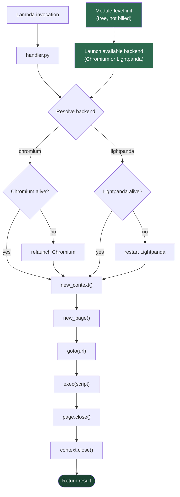
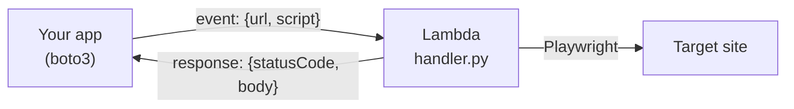
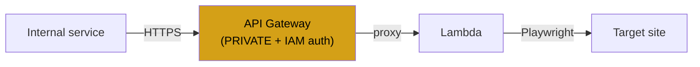
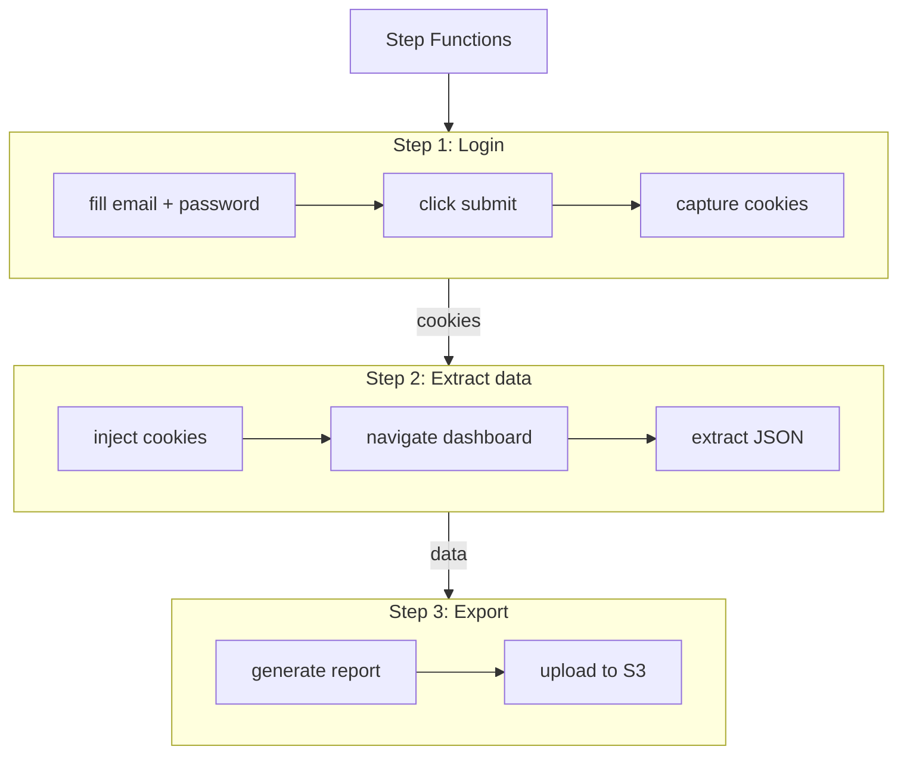
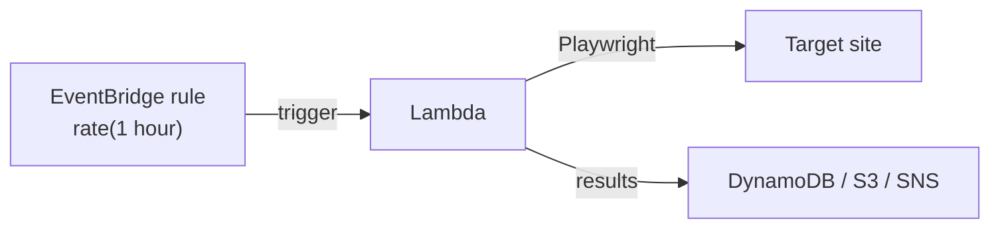
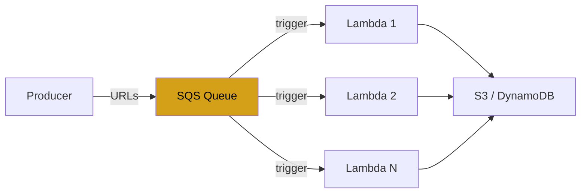

# Architecture

## Container internals



### Why module-level launch?

Lambda's init phase runs before the first invocation and is **not billed**. By launching Chromium during init, the cold start cost is absorbed into free time. On warm starts (subsequent invocations reusing the same execution environment), the browser is already running — only page creation and navigation are needed.

### Browser backends

The handler supports two backends: Chromium (via Playwright's bundled browser) and Lightpanda (via CDP connection to a subprocess). At module init, the handler detects which backend is installed and launches it eagerly. Only one backend is present per container image.

| Backend | Detection | Connection | Image |
|---------|-----------|------------|-------|
| Chromium | `PLAYWRIGHT_BROWSERS_PATH` contains chromium | `_pw.chromium.launch()` | `src/Dockerfile` |
| Lightpanda | `shutil.which("lightpanda")` | subprocess + `_pw.chromium.connect_over_cdp()` | `src/Dockerfile.lightpanda` |

### Cold vs. warm start lifecycle

```mermaid
sequenceDiagram
    participant L as Lambda Service
    participant H as handler.py
    participant C as Chromium

    rect rgb(45, 106, 79)
        Note over L,C: Cold start (init phase — free)
        L->>H: import handler
        H->>C: chromium.launch()
        C-->>H: browser ready
    end

    rect rgb(64, 64, 64)
        Note over L,C: Invocation 1
        L->>H: handler(event)
        H->>C: new_context() + new_page()
        C-->>H: page ready
        H->>C: goto(url) + exec(script)
        C-->>H: result
        H->>C: page.close() + context.close()
        H-->>L: response
    end

    rect rgb(64, 64, 64)
        Note over L,C: Invocation 2 (warm — browser reused)
        L->>H: handler(event)
        H->>C: new_context() + new_page()
        C-->>H: page ready
        H->>C: goto(url) + exec(script)
        C-->>H: result
        H->>C: page.close() + context.close()
        H-->>L: response
    end
```



### Chromium flags

The handler launches Chromium with flags optimized for Lambda's environment:

| Flag | Purpose |
|------|---------|
| `--no-sandbox` | Lambda already runs in a sandbox; Chrome's sandbox requires privileges not available in Lambda |
| `--disable-dev-shm-usage` | Lambda containers have a 64 MB `/dev/shm`; this flag forces temp files to disk |
| `--no-zygote` | Disables the forking model (unnecessary in a single-invocation container) |
| `--disable-gpu` | No GPU in Lambda |
| `--disable-extensions` | No extensions needed |
| `--disable-background-networking` | Prevents background network requests between invocations |
| `--disable-component-update` | Prevents Chromium from checking for updates |
| `--disk-cache-dir=/tmp/chrome-cache` | Persists V8 code cache across warm invocations |

`--single-process` is intentionally omitted — it causes the browser to crash between invocations.

---

## Integration patterns

### Pattern 1: Direct SDK invocation

The simplest pattern. Your application invokes the Lambda function directly via the AWS SDK.



Best for: backend services, data pipelines, scheduled jobs.

See [`examples/invoke.py`](examples/invoke.py) for a complete helper.

### Pattern 2: API Gateway + Lambda (private)

Expose the function behind a private API Gateway for internal services.



**SAM template addition:**

```yaml
Resources:
  PlaywrightApi:
    Type: AWS::Serverless::Api
    Properties:
      StageName: prod
      Auth:
        DefaultAuthorizer: AWS_IAM
      EndpointConfiguration:
        Type: PRIVATE
      MethodSettings:
        - HttpMethod: "*"
          ResourcePath: "/*"
          ThrottlingBurstLimit: 10
          ThrottlingRateLimit: 5

  TheatreFunction:
    Type: AWS::Serverless::Function
    Properties:
      PackageType: Image
      Events:
        Api:
          Type: Api
          Properties:
            RestApiId: !Ref PlaywrightApi
            Path: /run
            Method: POST
      # ... rest of function config
```

Key points:
- `EndpointConfiguration: PRIVATE` ensures no public access
- `AWS_IAM` authorization requires signed requests
- Throttling prevents runaway costs
- Callers need IAM `execute-api:Invoke` permission

### Pattern 3: Step Functions (multi-step workflows)

Chain multiple browser operations across invocations. Each step gets a fresh page but reuses the warm browser.



> **Important:** The handler returns `{"statusCode": 200, "body": "<JSON string>"}` where `body` is a JSON-encoded string, not an object. To pass data between steps, use a [Pass state with `States.StringToJson`](https://docs.aws.amazon.com/step-functions/latest/dg/amazon-states-language-intrinsic-functions.html) to deserialize `body` before accessing nested fields like `cookies`. The example below is simplified for readability — a production workflow needs this deserialization step.

**State machine definition:**

```json
{
  "StartAt": "Login",
  "States": {
    "Login": {
      "Type": "Task",
      "Resource": "arn:aws:lambda:REGION:ACCOUNT:function:TheatreFunction",
      "Parameters": {
        "url": "https://app.example.com/login",
        "script": "page.fill('#email', event['params']['email'])\npage.fill('#password', event['params']['password'])\npage.click('button[type=submit]')\npage.wait_for_url('**/dashboard**')\nresult['cookies'] = context.cookies()",
        "params": {
          "email.$": "$.email",
          "password.$": "$.password"
        }
      },
      "ResultPath": "$.login",
      "Next": "ExtractData"
    },
    "ExtractData": {
      "Type": "Task",
      "Resource": "arn:aws:lambda:REGION:ACCOUNT:function:TheatreFunction",
      "Parameters": {
        "url": "https://app.example.com/dashboard",
        "script": "for c in event['params']['cookies']:\n    context.add_cookies([c])\npage.reload()\nresult['data'] = page.evaluate('() => JSON.parse(document.querySelector(\"#data\").textContent)')",
        "params": {
          "cookies.$": "$.login.body.cookies"
        }
      },
      "ResultPath": "$.extract",
      "End": true
    }
  }
}
```

Key points:
- Use Express Workflows for sub-5-minute flows (cheaper, synchronous)
- Use Standard Workflows for longer flows or those needing retry/error handling
- Each step is a separate Lambda invocation but likely hits a warm browser

### Pattern 4: EventBridge scheduled scraping

Scrape a page on a schedule (e.g., price monitoring, status checks).



**SAM template addition:**

```yaml
Resources:
  TheatreFunction:
    Type: AWS::Serverless::Function
    Properties:
      PackageType: Image
      Events:
        HourlyScrape:
          Type: Schedule
          Properties:
            Schedule: rate(1 hour)
            Input: >
              {
                "url": "https://example.com/pricing",
                "s3_uri": "s3://my-scripts/check_price.py"
              }
```

### Pattern 5: SQS queue for batch processing

Process a queue of URLs, one per invocation. Lambda scales automatically.



**SAM template addition:**

```yaml
Resources:
  UrlQueue:
    Type: AWS::SQS::Queue
    Properties:
      VisibilityTimeout: 180

  TheatreFunction:
    Type: AWS::Serverless::Function
    Properties:
      PackageType: Image
      Events:
        SqsTrigger:
          Type: SQS
          Properties:
            Queue: !GetAtt UrlQueue.Arn
            BatchSize: 1
      ReservedConcurrentExecutions: 10
```

Key points:
- `BatchSize: 1` ensures one URL per invocation (Chromium handles one page at a time)
- `ReservedConcurrentExecutions` caps parallel browser instances (cost control)
- Failed messages return to the queue and retry automatically

---

## Cost model

| Component | Cost driver |
|-----------|------------|
| Lambda compute | Duration x memory (2048 MB recommended) |
| Lambda init | Free (not billed) |
| ECR storage | ~1.2 GB image stored |
| Data transfer | Chromium's outbound requests |

Rough estimate for 10,000 invocations/month at 2048 MB, ~4.5s average duration (based on [benchmarks](README.md#benchmarks)):
- Lambda: ~$1.52
- ECR: ~$0.12
- Total: ~$1.64/month

## Limitations

- **Image size**: ~1.2 GB (Chromium + system deps). Well within Lambda's 10 GB limit but affects first-ever cold start (image pull).
- **Memory**: 2048 MB minimum recommended. Below this, Chromium may OOM on complex pages.
- **Timeout**: max 15 minutes per invocation. For longer workflows, use Step Functions.
- **Concurrency**: each invocation runs one browser page. Scale via Lambda concurrency, not in-function parallelism.
- **No persistent state**: each invocation gets a fresh BrowserContext. Pass cookies/tokens between invocations explicitly.
- **No stealth**: standard Chromium, detectable as headless. For anti-detection, consider upstream patches or browser flags.
