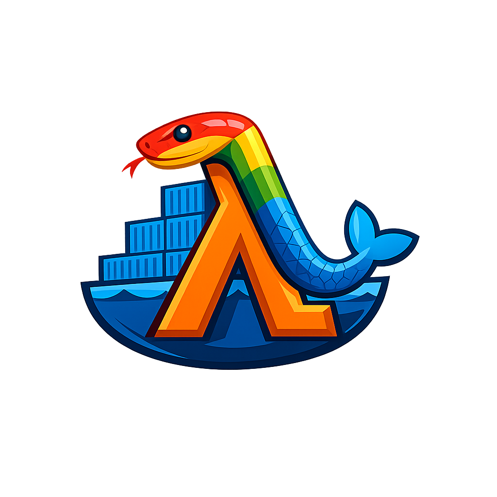
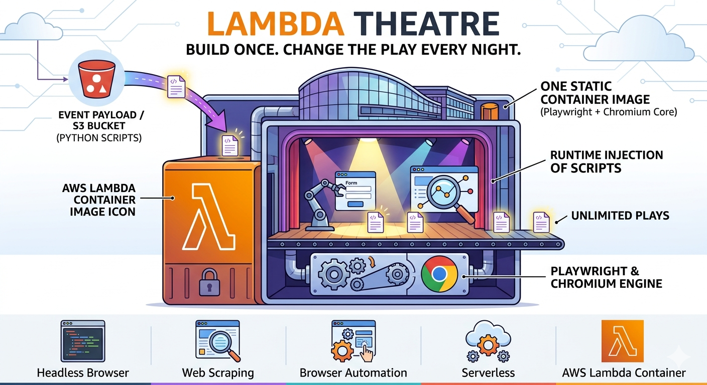
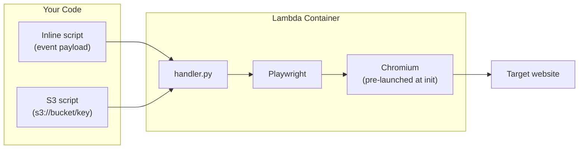

<p align="center">
  
</p>

<h1 align="center">Lambda Theatre</h1>

<p align="center">
  <em>Build the theatre once. Change the play every night.</em><br><br>
  Playwright + Chromium (or Lightpanda) on AWS Lambda as a container image.<br>
  Inject Python browser automation scripts at runtime via event payload or S3.<br>
  No rebuild needed — one image, unlimited scripts.
</p>

<p align="center">
  <strong>Headless browser</strong> | <strong>Web scraping</strong> | <strong>Browser automation</strong> | <strong>Serverless</strong> | <strong>AWS Lambda container</strong>
</p>

<p align="center">
  <a href="https://github.com/dgallitelli/lambda-theatre/actions/workflows/ci.yml"></a>
  
  
  
  
  <a href="https://github.com/dgallitelli/lambda-theatre/blob/main/LICENSE"></a>
</p>

---

**Table of contents:** [How it works](#how-it-works) | [Quick start](#quick-start) | [Usage](#usage) | [Writing scripts](#writing-scripts) | [Browser backends](#browser-backends) | [Examples](#examples) | [Benchmarks](#benchmarks) | [Cold start optimization](#cold-start-optimization) | [Security](#security) | [Project structure](#project-structure)

---

## How it works

<p align="center">
  
</p>

The container image ships Chromium and Playwright pre-installed on Ubuntu 25.04. At Lambda cold start, Chromium launches during the **free init phase** (not billed). Your Playwright script runs against the already-warm browser, then the page and context are cleaned up. On warm starts, the browser is reused — only a new page is created.



## Quick start

### 1. Build and test locally

```bash
make build
make test
```

Or manually:

```bash
docker build -t lambda-theatre src/
docker run -d --name test -p 9000:8080 lambda-theatre
sleep 3

curl -s -XPOST "http://localhost:9000/2015-03-31/functions/function/invocations" \
  -d '{"url": "https://example.com", "script": "result[\"title\"] = page.title()"}' \
  | python3 -m json.tool

docker rm -f test
```

### 2. Deploy to AWS

```bash
sam build --template infra/template.yaml && sam deploy --guided --stack-name lambda-theatre
```

### 3. Invoke

```bash
aws lambda invoke \
  --function-name TheatreFunction \
  --cli-binary-format raw-in-base64-out \
  --payload '{"url": "https://example.com", "script": "result[\"title\"] = page.title()"}' \
  /dev/stdout | python3 -m json.tool
```

Or with the included helper:

```bash
python3 examples/invoke.py --url https://example.com --script "result['title'] = page.title()"
```

## Usage

### Event schema

```json
{
  "browser": "chromium",
  "url": "https://example.com",
  "script": "result['title'] = page.title()",
  "s3_uri": "s3://my-bucket/scripts/scrape.py",
  "timeout": 30,
  "wait_until": "load",
  "viewport": {"width": 1280, "height": 720},
  "user_agent": "custom-agent/1.0",
  "params": {"any": "data your script needs"}
}
```

| Field | Required | Description |
|-------|----------|-------------|
| `script` | One of `script` or `s3_uri` | Inline Python code (takes precedence over `s3_uri`) |
| `s3_uri` | One of `script` or `s3_uri` | S3 path to a `.py` script file (ignored if `script` is set) |
| `browser` | No | `"chromium"` \| `"lightpanda"` (default: auto-detect from image) |
| `url` | No | Navigate to this URL before running the script |
| `timeout` | No | Timeout in seconds (default: 30) |
| `wait_until` | No | `load` \| `domcontentloaded` \| `networkidle` (default: `load`) |
| `viewport` | No | `{width, height}` (default: 1280x720, Chromium only) |
| `user_agent` | No | Custom User-Agent string |
| `params` | No | Arbitrary data accessible as `event["params"]` in your script |

### Script environment

Your script receives these variables pre-bound. Standard `import` statements also work (e.g., `import boto3`, `import time`).

| Variable | Type | Description |
|----------|------|-------------|
| `page` | `playwright.sync_api.Page` | Already navigated to `event["url"]` if provided |
| `browser` | `playwright.sync_api.Browser` | Persistent across warm starts |
| `context` | `playwright.sync_api.BrowserContext` | Fresh per invocation |
| `event` | `dict` | Full Lambda event (access `event["params"]`, etc.) |
| `result` | `dict` | Put your return data here |
| `json` | `module` | The `json` module, pre-imported |

### Writing scripts

Scripts are **bare Playwright code** — not Python modules. Don't write `def main()`, `if __name__`, or class definitions. Just write the steps directly, as if you're in the middle of a function that already has `page`, `event`, and `result` in scope.

```python
# my_script.py — correct
page.wait_for_selector("h1")
result["title"] = page.title()
result["heading"] = page.inner_text("h1")
```

```python
# my_script.py — WRONG (will not work)
def main():
    page.wait_for_selector("h1")
    return page.title()

if __name__ == "__main__":
    main()
```

Standard imports work at the top of the script (`boto3`, `json`, `time`, and other packages already installed in the container):

```python
import time
import boto3

page.click("#load-more")
time.sleep(2)
result["items"] = page.evaluate("document.querySelectorAll('.item').length")
```

> **Need additional packages?** Scripts can import any package installed in the container image (`playwright`, `boto3`, and Python stdlib are included by default). To add more, add them to `src/requirements.txt` and rebuild: `make build`. The image is the theatre — rebuild it once when your dependencies change, then swap scripts freely. If you think a package should be included by default, [open an issue](https://github.com/dgallitelli/lambda-theatre/issues).

See the [`examples/`](examples/) directory — every file there is a working script you can upload directly.

### Loading scripts from S3

Upload a script file and invoke by S3 URI:

```bash
aws s3 cp my_script.py s3://my-bucket/scripts/my_script.py
```

```json
{"url": "https://example.com", "s3_uri": "s3://my-bucket/scripts/my_script.py"}
```

The Lambda function needs `s3:GetObject` permission on the bucket. The SAM template handles this automatically — pass the bucket name at deploy time:

```bash
sam deploy --template infra/template.yaml --parameter-overrides ScriptBucket=my-bucket
```

Or add the permission manually if deploying outside SAM:

```json
{
  "Effect": "Allow",
  "Action": "s3:GetObject",
  "Resource": "arn:aws:s3:::my-bucket/scripts/*"
}
```

## Examples

### Extract text from a page

```json
{"url": "https://example.com", "script": "result['text'] = page.inner_text('body')"}
```

### Interact with a React SPA

```json
{
  "url": "https://todomvc.com/examples/react/dist/",
  "script": "page.wait_for_selector('input.new-todo')\nfor item in event['params']['todos']:\n    page.fill('input.new-todo', item)\n    page.press('input.new-todo', 'Enter')\nresult['count'] = page.locator('ul.todo-list li').count()",
  "params": {"todos": ["Buy milk", "Write tests", "Ship it"]}
}
```

### Fill a login form and submit

```json
{
  "url": "https://the-internet.herokuapp.com/login",
  "script": "page.fill('#username', 'tomsmith')\npage.fill('#password', 'SuperSecretPassword!')\npage.click('button[type=\"submit\"]')\npage.wait_for_load_state('load')\nresult['url'] = page.url\nresult['message'] = page.text_content('#flash')"
}
```

### Multi-step scraper (S3)

Upload [`examples/hacker_news_scraper.py`](examples/hacker_news_scraper.py) to S3 and invoke:

```bash
aws s3 cp examples/hacker_news_scraper.py s3://my-bucket/scripts/
python3 examples/invoke.py --s3 s3://my-bucket/scripts/hacker_news_scraper.py --param limit=5
```

See the [`examples/`](examples/) directory for all example scripts.

## Browser backends

Lambda Theatre supports two browser backends. Each ships as its own container image.

| Backend | Image | Size | Best for |
|---------|-------|------|----------|
| **Chromium** (default) | `lambda-theatre` | ~1.2 GB | Full compatibility — SPAs, complex JS, screenshots, PDF |
| **Lightpanda** | `lambda-theatre-lightpanda` | ~450 MB | Speed — 2-4x faster on light pages, 63% smaller image |

### Building the Lightpanda image

```bash
make build-lightpanda
make test-lightpanda
```

Or manually:

```bash
docker build -t lambda-theatre-lightpanda -f src/Dockerfile.lightpanda src/
```

### Choosing a backend

Deploy whichever image fits your workload. The handler auto-detects the available backend. To request a specific backend explicitly (useful if both are installed locally):

```json
{"browser": "lightpanda", "url": "https://example.com", "script": "result['title'] = page.title()"}
```

### Lightpanda trade-offs

Lightpanda is a Zig-based headless browser that speaks the Chrome DevTools Protocol. Scripts work identically on both backends — the `page`, `browser`, and `context` objects use the same Playwright API.

**Limitations vs Chromium:**
- No `viewport` support (viewport option is ignored)
- No `wait_until` support in navigation (pages load fully before returning)
- May fail on navigation-heavy pages that destroy execution contexts mid-load
- Slower on extremely JS-heavy pages (no JIT compiler)
- Nightly builds only (x86_64 Linux)

## Benchmarks

Measured on AWS Lambda (us-east-1) using [Lambda Power Tuning](https://github.com/alexcasalboni/aws-lambda-power-tuning) with the [Hacker News scraper](examples/hacker_news_scraper.py) (navigates to HN, visits 5 story URLs, extracts metadata from each). 10 invocations per memory size.

### Memory size vs. performance

| Memory | Avg Duration | Cost / invocation | Relative speed |
|--------|-------------|-------------------|---------------|
| 512 MB | 20,422ms | $0.000172 | 4.5x slower |
| 768 MB | 14,313ms | $0.000180 | 3.2x slower |
| 1024 MB | 9,650ms | $0.000162 | 2.1x slower |
| 1536 MB | 7,201ms | $0.000181 | 1.6x slower |
| **2048 MB** | **4,531ms** | **$0.000152** | **baseline** |
| 3072 MB | 3,181ms | $0.000160 | 1.4x faster |

[Interactive visualization](https://lambda-power-tuning.show/#AAIAAwAEAAYACAAM;W4ufRn2lX0ZGyBZG9gPhRcaUjUVmykZF;9uIzOQ0ePTlEAyo5skc+ORCsHzk3HCg5)

**2048 MB is the sweet spot** — cheapest per invocation AND fast. Above 2048 MB, the workload becomes network-bound (waiting for page loads), so extra CPU doesn't help. Below 1024 MB, reduced CPU makes everything slower without meaningful cost savings.

### Cold start vs. warm start (2048 MB)

| Scenario | Init Duration | Handler Duration | Total |
|----------|--------------|------------------|-------|
| Cold start (image cached) | 1,925ms | 280ms | 2,205ms |
| Cold start (typical) | 3,659ms | 511ms | 4,171ms |
| Cold start (image evicted) | 6,616ms | 838ms | 7,454ms |
| **Warm start (simple page)** | — | **115-131ms** | **~120ms** |
| **Warm start (React SPA)** | — | **2,243ms** | **~2.2s** |
| **Warm start (multi-page scraper)** | — | **4,531ms** | **~4.5s** |

Cold start variance is dominated by whether the container image is cached on the Lambda worker. After the first pull, subsequent cold starts on the same host are ~2s.

### Memory usage

| Workload | Peak Memory |
|----------|-------------|
| Simple page (title extraction) | ~470 MB |
| React SPA (fill, click, toggle) | ~525 MB |
| Multi-page scraper (5 URLs) | ~660 MB |

### Cost projections (2048 MB)

| Invocations/month | Estimated cost |
|-------------------|---------------|
| 1,000 | $0.15 |
| 10,000 | $1.52 |
| 100,000 | $15.23 |

## Cold start optimization

This image applies several techniques to minimize cold start latency:

1. **Module-level browser launch** — Chromium starts during Lambda's free init phase (not billed)
2. **Optimized Chromium flags** — 15+ flags disable unnecessary features (extensions, sync, translate, background networking, component updates)
3. **Disk cache in /tmp** — V8 compiled code and resources persist across warm invocations
4. **Layer ordering** — Dockerfile layers ordered by change frequency (OS first, handler code last)
5. **Stripped locales and docs** — unnecessary Chromium files removed from image

### Keeping the function warm

To avoid cold starts during normal traffic, add a scheduled warmup ping:

```bash
aws events put-rule --name playwright-warmup --schedule-expression "rate(5 minutes)"
```

The handler detects empty/warmup events (no `script` or `s3_uri`) and returns `{"statusCode": 200, "body": "warm"}` immediately, keeping the execution environment alive.

**Cost comparison (2048 MB, keeping 1 instance warm):**

| Strategy | Monthly cost | Guarantee |
|----------|-------------|-----------|
| EventBridge warmup (5 min) | ~$0.07 | Best-effort (Lambda may occasionally recycle the environment) |
| Provisioned concurrency = 1 | ~$21.60 | Guaranteed always-warm |

The warmup approach is **300x cheaper** and works well in practice — Lambda rarely recycles environments that are pinged every 5 minutes. Use provisioned concurrency only when you need a hard SLA on response latency.

## Security

> **The `script` and `s3_uri` fields execute arbitrary Python code** with the full permissions of the Lambda execution role. Never expose this function to untrusted input without an authorization layer.

**Production hardening:**
- Use `s3_uri` with pre-approved scripts only — consider removing `script` field support in your fork
- Restrict the Lambda execution role to minimum required permissions
- Add API Gateway with IAM auth or a custom authorizer if exposing via HTTP
- Use VPC and security groups to limit Chromium's network access
- Set `PLAYWRIGHT_DEBUG=false` (default) to suppress stack traces in error responses. Set to `true` only for development.

**Other notes:**
- **No public endpoints.** The SAM template creates a Lambda function with no Function URL, no API Gateway, and no public access. Invoke via SDK or CLI only.
- **Chromium runs with `--no-sandbox`** because Lambda does not support the Chrome sandbox. Navigating to untrusted URLs exposes the function to browser-level exploits without sandbox protection.
- **Chromium binds to localhost.** No network ports are exposed.

## Project structure

```
src/
  Dockerfile           Chromium image (Ubuntu 25.04 + Chromium + Playwright + Lambda RIE)
  Dockerfile.lightpanda  Lightpanda image (no Chromium, ~450 MB)
  handler.py           Lambda handler (script injection runtime)
  entry.sh             Bootstrap (Lambda RIE for local, awslambdaric for deployed)
  requirements.txt     Python dependencies
infra/
  template.yaml        SAM template (one function, no public access)
examples/
  invoke.py            Python helper for invoking the function (local + deployed)
  hacker_news_scraper.py   Multi-step scraper (navigates 5+ pages)
  extract_links.py         Extract all links from a page
  form_fill_submit.py      Fill and submit a login form
  screenshot_to_s3.py      Full-page screenshot uploaded to S3
  todomvc_add_items.py     React SPA interaction
  wait_and_extract.py      Wait for dynamic content, extract structured data
Makefile               build / test / deploy shortcuts
ARCHITECTURE.md        Integration patterns (API Gateway, Step Functions, SQS, EventBridge)
```

## Why container image?

Lambda zip deployments have a 250 MB unzipped limit. Chromium alone is ~300 MB. Container images support up to 10 GB, and Lambda caches them across invocations.

Ubuntu 25.04 is used because Playwright's Chromium requires GLIBC 2.39+, which Amazon Linux 2023 (GLIBC 2.34) does not ship. Ubuntu 25.04 provides GLIBC 2.41 and Python 3.13 out of the box.

## Requirements

- Docker
- AWS SAM CLI (for deployment)
- Python 3.12+ (for local invocation helper; container uses 3.13)
- AWS credentials configured

## License

MIT
