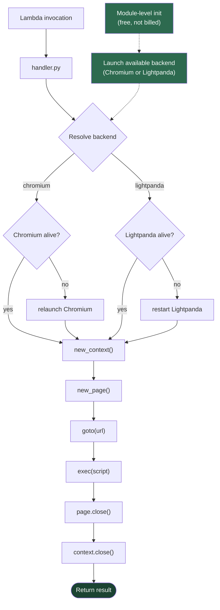

# Lightpanda Browser Backend Implementation Plan

> **For agentic workers:** REQUIRED SUB-SKILL: Use superpowers:subagent-driven-development (recommended) or superpowers:executing-plans to implement this plan task-by-task. Steps use checkbox (`- [ ]`) syntax for tracking.

**Goal:** Add Lightpanda as a second browser backend to lambda-theatre, shipping in its own container image, with a shared handler.py that auto-detects the available backend.

**Architecture:** The handler auto-detects which browser is installed at module-level init (Playwright's Chromium path vs `shutil.which("lightpanda")`). A new optional `"browser"` event field lets callers request a specific backend. Each backend has its own Dockerfile. Scripts are backend-agnostic — the `page`, `browser`, `context` objects work identically.

**Tech Stack:** Python 3.13, Playwright (sync API + CDP connect), Lightpanda nightly binary, Docker, pytest

---

## File Map

| File | Action | Responsibility |
|------|--------|---------------|
| `src/handler.py` | Modify | Add dual-backend support with auto-detection, `_ensure_chromium()`, `_ensure_lightpanda()`, backend-aware context/goto |
| `src/Dockerfile` | Unchanged | Chromium-only image (existing) |
| `src/Dockerfile.lightpanda` | Create | Lightpanda-only image (~450 MB) |
| `tests/conftest.py` | Modify | Add `lightpanda_container` fixture using Lightpanda image |
| `tests/test_handler_unit.py` | Modify | Add `browser` field validation tests |
| `tests/test_handler_integration.py` | Modify | Add Lightpanda integration tests |
| `Makefile` | Modify | Add `build-lightpanda`, `test-lightpanda`, `test-all-lightpanda` targets |
| `README.md` | Modify | Add `browser` field to schema, Lightpanda section, build instructions |
| `ARCHITECTURE.md` | Modify | Update flow diagram and add Lightpanda notes |
| `CHANGELOG.md` | Modify | Add feature entry |

---

### Task 1: Refactor handler.py — dual backend support

**Files:**
- Modify: `src/handler.py`

- [ ] **Step 1: Rename Chromium globals and add backend detection**

Replace the current module-level init and `_ensure_browser()` in `src/handler.py` with:

```python
"""
Playwright browser automation runtime for AWS Lambda.

Supports two browser backends:
  - Chromium (via Playwright, default) — full browser, larger image
  - Lightpanda (via CDP) — lightweight, faster, smaller image

The handler auto-detects which backend is available based on what's installed
in the container image. The event field "browser" can request a specific backend.

Accepts a Playwright script via:
  1. event["script"]  -- inline Python code (string)
  2. event["s3_uri"]  -- S3 path to a .py file (s3://bucket/scripts/scrape.py)

If both are provided, "script" takes precedence.

The script receives these pre-bound variables:
  - page      Playwright Page (navigated to event["url"] if provided)
  - browser   Playwright Browser instance (persistent across warm starts)
  - context   Playwright BrowserContext (fresh per invocation)
  - event     the full Lambda event dict
  - result    dict -- put your return data here

Standard imports (import boto3, import time, etc.) work normally in scripts.

Optional event fields:
  - browser       "chromium" | "lightpanda" (default: auto-detect)
  - url           navigate before running script
  - wait_until    "load" | "domcontentloaded" | "networkidle" | "commit" (default: "load")
  - timeout       seconds (default: 30)
  - viewport      {width, height} (default: 1280x720, Chromium only)
  - user_agent    custom User-Agent string
"""

import json
import os
import shutil
import subprocess
import time as _time
import traceback
import urllib.request

from playwright.sync_api import sync_playwright

CHROMIUM_ARGS = [
    "--no-sandbox",
    "--disable-setuid-sandbox",
    "--disable-gpu",
    "--disable-dev-shm-usage",
    "--no-zygote",
    "--no-first-run",
    "--disable-extensions",
    "--disable-background-networking",
    "--disable-default-apps",
    "--disable-sync",
    "--disable-translate",
    "--disable-component-update",
    "--disable-renderer-backgrounding",
    "--disable-backgrounding-occluded-windows",
    "--disable-ipc-flooding-protection",
    "--disable-features=PaintHolding",
    "--metrics-recording-only",
    "--mute-audio",
    "--font-render-hinting=none",
    "--disk-cache-dir=/tmp/chrome-cache",
]

_VALID_WAIT_UNTIL = {"load", "domcontentloaded", "networkidle", "commit"}
_VALID_BROWSERS = {"chromium", "lightpanda"}
_DEBUG = os.environ.get("PLAYWRIGHT_DEBUG", "").lower() in ("1", "true")
_LIGHTPANDA_PORT = 9333

# --- Detect available backends ---
_pw = sync_playwright().start()

_CHROMIUM_AVAILABLE = bool(
    os.environ.get("PLAYWRIGHT_BROWSERS_PATH")
    and any(
        (p / "chrome-linux" / "chrome").exists() or (p / "chrome-linux" / "headless_shell").exists()
        for p in __import__("pathlib").Path(os.environ["PLAYWRIGHT_BROWSERS_PATH"]).glob("chromium-*")
    )
)
_LIGHTPANDA_AVAILABLE = bool(shutil.which("lightpanda"))

# --- Launch available backend at init (free phase) ---
_chromium_browser = None
_lp_browser = None
_lp_proc = None

if _CHROMIUM_AVAILABLE:
    _chromium_browser = _pw.chromium.launch(headless=True, args=CHROMIUM_ARGS)

if _LIGHTPANDA_AVAILABLE:
    _lp_proc = subprocess.Popen(
        ["lightpanda", "serve", "--host", "127.0.0.1", "--port", str(_LIGHTPANDA_PORT)],
        stdout=subprocess.PIPE,
        stderr=subprocess.PIPE,
    )
    for _ in range(30):
        try:
            urllib.request.urlopen(
                f"http://127.0.0.1:{_LIGHTPANDA_PORT}/json/version", timeout=1
            )
            break
        except Exception:
            _time.sleep(0.2)
    _lp_browser = _pw.chromium.connect_over_cdp(f"http://127.0.0.1:{_LIGHTPANDA_PORT}")


def _ensure_chromium():
    global _chromium_browser
    try:
        if _chromium_browser and _chromium_browser.is_connected():
            _chromium_browser.contexts
            return
    except Exception:
        pass
    _chromium_browser = _pw.chromium.launch(headless=True, args=CHROMIUM_ARGS)


def _ensure_lightpanda():
    global _lp_browser, _lp_proc
    try:
        if _lp_proc and _lp_proc.poll() is None and _lp_browser and _lp_browser.is_connected():
            return
    except Exception:
        pass
    if _lp_proc:
        try:
            _lp_proc.kill()
        except Exception:
            pass
    _lp_proc = subprocess.Popen(
        ["lightpanda", "serve", "--host", "127.0.0.1", "--port", str(_LIGHTPANDA_PORT)],
        stdout=subprocess.PIPE,
        stderr=subprocess.PIPE,
    )
    for _ in range(30):
        try:
            urllib.request.urlopen(
                f"http://127.0.0.1:{_LIGHTPANDA_PORT}/json/version", timeout=1
            )
            break
        except Exception:
            _time.sleep(0.2)
    _lp_browser = _pw.chromium.connect_over_cdp(f"http://127.0.0.1:{_LIGHTPANDA_PORT}")


def _fetch_script_from_s3(s3_uri):
    import boto3

    if not s3_uri.startswith("s3://") or "/" not in s3_uri[5:]:
        raise ValueError(f"Invalid S3 URI: {s3_uri}. Expected s3://bucket/key")
    parts = s3_uri[5:].split("/", 1)
    bucket, key = parts[0], parts[1]
    s3 = boto3.client("s3")
    resp = s3.get_object(Bucket=bucket, Key=key)
    return resp["Body"].read().decode("utf-8")


def handler(event, context):
    if not event or (not event.get("script") and not event.get("s3_uri")):
        return {"statusCode": 200, "body": "warm"}

    # --- Validate and resolve browser backend ---
    requested = event.get("browser")
    if requested is not None and requested not in _VALID_BROWSERS:
        return {
            "statusCode": 400,
            "body": f"Field 'browser' must be one of {sorted(_VALID_BROWSERS)}",
        }

    if requested == "chromium" and not _CHROMIUM_AVAILABLE:
        return {"statusCode": 400, "body": "Browser 'chromium' is not available in this image"}
    if requested == "lightpanda" and not _LIGHTPANDA_AVAILABLE:
        return {"statusCode": 400, "body": "Browser 'lightpanda' is not available in this image"}

    if requested:
        use_backend = requested
    elif _CHROMIUM_AVAILABLE:
        use_backend = "chromium"
    elif _LIGHTPANDA_AVAILABLE:
        use_backend = "lightpanda"
    else:
        return {"statusCode": 500, "body": "No browser backend available"}

    if use_backend == "chromium":
        _ensure_chromium()
        active_browser = _chromium_browser
    else:
        _ensure_lightpanda()
        active_browser = _lp_browser

    # --- Validate inputs ---
    script = event.get("script")
    s3_uri = event.get("s3_uri")

    if s3_uri and not script:
        try:
            script = _fetch_script_from_s3(s3_uri)
        except Exception as e:
            return {"statusCode": 502, "body": f"Failed to fetch from S3: {e}"}

    url = event.get("url")
    try:
        timeout_ms = int(event.get("timeout", 30)) * 1000
    except (TypeError, ValueError):
        return {"statusCode": 400, "body": "Field 'timeout' must be a number (seconds)"}

    viewport = event.get("viewport", {"width": 1280, "height": 720})
    if not isinstance(viewport, dict) or "width" not in viewport or "height" not in viewport:
        return {
            "statusCode": 400,
            "body": 'Field \'viewport\' must be {"width": int, "height": int}',
        }

    wait_until = event.get("wait_until", "load")
    if wait_until not in _VALID_WAIT_UNTIL:
        return {
            "statusCode": 400,
            "body": f"Field 'wait_until' must be one of {sorted(_VALID_WAIT_UNTIL)}",
        }

    ctx = None
    page = None
    try:
        context_kwargs = {}
        if use_backend == "chromium":
            context_kwargs["viewport"] = viewport
        if event.get("user_agent"):
            context_kwargs["user_agent"] = event["user_agent"]

        ctx = active_browser.new_context(**context_kwargs)
        page = ctx.new_page()
        page.set_default_timeout(timeout_ms)
        page.set_default_navigation_timeout(timeout_ms)

        if url:
            goto_kwargs = {}
            if use_backend == "chromium":
                goto_kwargs["wait_until"] = wait_until
            page.goto(url, **goto_kwargs)

        result = {}

        exec(
            script,
            {
                "__name__": "__script__",
                "page": page,
                "browser": active_browser,
                "context": ctx,
                "event": event,
                "result": result,
                "json": json,
            },
        )

        return {"statusCode": 200, "body": json.dumps(result, default=str)}

    except Exception as e:
        body = {"error": type(e).__name__, "message": str(e)}
        if _DEBUG:
            body["trace"] = traceback.format_exc().split("\n")[-4:]
        return {"statusCode": 500, "body": json.dumps(body)}
    finally:
        if page:
            try:
                page.close()
            except Exception:
                pass
        if ctx:
            try:
                ctx.close()
            except Exception:
                pass
```

- [ ] **Step 2: Verify existing tests still pass with Chromium image**

Run:
```bash
cd /home/ec2-user/lambda-theatre && make build && pytest tests/ -v --timeout=120 -x
```

Expected: All existing tests pass (the refactored handler is backward-compatible).

- [ ] **Step 3: Commit**

```bash
git add src/handler.py
git commit -m "refactor: dual-backend handler with auto-detection

Support Chromium and Lightpanda backends. Auto-detect available
backend at init. New optional 'browser' event field for explicit
selection. Chromium behavior unchanged when no field is provided."
```

---

### Task 2: Create Dockerfile.lightpanda

**Files:**
- Create: `src/Dockerfile.lightpanda`

- [ ] **Step 1: Create the Lightpanda Dockerfile**

Create `src/Dockerfile.lightpanda`:

```dockerfile
FROM ubuntu:25.04

# Layer 1: OS packages (rarely changes)
RUN apt-get update && apt-get install -y --no-install-recommends \
    python3 python3-pip curl ca-certificates && \
    apt-get clean && rm -rf /var/lib/apt/lists/*

# Layer 2: Playwright Python package + boto3 (NO browser install)
COPY requirements.txt /tmp/requirements.txt
RUN pip3 install --no-cache-dir --break-system-packages -r /tmp/requirements.txt && \
    rm -rf /root/.cache/pip /tmp/requirements.txt

# Layer 3: Lightpanda binary
RUN curl -fsSL -L \
    "https://github.com/lightpanda-io/browser/releases/download/nightly/lightpanda-x86_64-linux" \
    -o /usr/local/bin/lightpanda && \
    chmod +x /usr/local/bin/lightpanda

# Layer 4: Lambda runtime (rarely changes)
RUN pip3 install --no-cache-dir --break-system-packages awslambdaric && \
    rm -rf /root/.cache/pip

RUN curl -fsSL \
    "https://github.com/aws/aws-lambda-runtime-interface-emulator/releases/latest/download/aws-lambda-rie" \
    -o /usr/local/bin/aws-lambda-rie && \
    chmod +x /usr/local/bin/aws-lambda-rie

COPY entry.sh /entry.sh
RUN chmod +x /entry.sh

# Layer 5: Handler code (changes most often — LAST)
COPY handler.py /var/task/

WORKDIR /var/task
ENV HOME=/tmp

ENTRYPOINT ["/entry.sh"]
CMD ["handler.handler"]
```

- [ ] **Step 2: Build the Lightpanda image**

Run:
```bash
cd /home/ec2-user/lambda-theatre && docker build -t lambda-theatre-lightpanda -f src/Dockerfile.lightpanda src/
```

Expected: Image builds successfully, size ~450-500 MB.

- [ ] **Step 3: Smoke test the Lightpanda image**

Run:
```bash
docker rm -f lp-smoke 2>/dev/null
docker run -d --name lp-smoke -p 9050:8080 lambda-theatre-lightpanda
sleep 15
curl -s -XPOST "http://localhost:9050/2015-03-31/functions/function/invocations" \
  -d '{"url": "https://example.com", "script": "result[\"title\"] = page.title()"}' | python3 -m json.tool
docker rm -f lp-smoke
```

Expected: `{"statusCode": 200, "body": "{\"title\": \"Example Domain\"}"}`

- [ ] **Step 4: Commit**

```bash
git add src/Dockerfile.lightpanda
git commit -m "feat: add Lightpanda Dockerfile

Lightweight image (~450 MB) with Lightpanda browser instead of
Chromium. Uses same handler.py and entry.sh. No Playwright browser
install — only the Python CDP client library."
```

---

### Task 3: Add Makefile targets

**Files:**
- Modify: `Makefile`

- [ ] **Step 1: Add Lightpanda build and test targets**

Add these lines to `Makefile` after the existing `clean` target, and update the `.PHONY` line:

Change the `.PHONY` line from:
```makefile
.PHONY: build test test-unit test-all deploy clean
```
to:
```makefile
.PHONY: build build-lightpanda test test-lightpanda test-unit test-all test-all-lightpanda deploy clean
```

Add these new targets at the end of the file:

```makefile
LP_IMAGE_NAME ?= lambda-theatre-lightpanda
LP_CONTAINER_NAME ?= lambda-theatre-lp-test

build-lightpanda:
	docker build -t $(LP_IMAGE_NAME) -f src/Dockerfile.lightpanda src/

test-lightpanda: build-lightpanda
	@docker rm -f $(LP_CONTAINER_NAME) 2>/dev/null || true
	docker run -d --name $(LP_CONTAINER_NAME) -p $(PORT):8080 $(LP_IMAGE_NAME)
	@sleep 8
	@echo "--- Smoke test: page title (Lightpanda) ---"
	@curl -s -XPOST "http://localhost:$(PORT)/2015-03-31/functions/function/invocations" \
		-d '{"url": "https://example.com", "script": "result[\"title\"] = page.title()"}' | python3 -m json.tool
	@echo ""
	@echo "--- SPA test: TodoMVC React fill + click (Lightpanda) ---"
	@curl -s -XPOST "http://localhost:$(PORT)/2015-03-31/functions/function/invocations" \
		-d '{"url":"https://todomvc.com/examples/react/dist/","script":"page.wait_for_selector(\"input.new-todo\")\npage.fill(\"input.new-todo\",\"Test\")\npage.press(\"input.new-todo\",\"Enter\")\nresult[\"count\"]=page.locator(\"ul.todo-list li\").count()"}' | python3 -m json.tool
	@docker rm -f $(LP_CONTAINER_NAME)

test-all-lightpanda: build-lightpanda
	pytest tests/ -v --timeout=120 -k lightpanda
```

- [ ] **Step 2: Verify existing targets still work**

Run:
```bash
cd /home/ec2-user/lambda-theatre && make test
```

Expected: Existing smoke tests pass unchanged.

- [ ] **Step 3: Commit**

```bash
git add Makefile
git commit -m "feat: add Makefile targets for Lightpanda image

build-lightpanda, test-lightpanda, test-all-lightpanda targets
mirror existing Chromium targets."
```

---

### Task 4: Add test fixtures and unit tests for browser field

**Files:**
- Modify: `tests/conftest.py`
- Modify: `tests/test_handler_unit.py`

- [ ] **Step 1: Add Lightpanda container fixture to conftest.py**

Replace `tests/conftest.py` with:

```python
import json
import subprocess
import time
import urllib.request

import pytest

CHROMIUM_CONTAINER = "lambda-theatre-ci"
LIGHTPANDA_CONTAINER = "lambda-theatre-lp-ci"
CHROMIUM_PORT = 9000
LIGHTPANDA_PORT = 9001


def make_invoker(port):
    base_url = f"http://localhost:{port}/2015-03-31/functions/function/invocations"

    def invoke(payload):
        data = json.dumps(payload).encode()
        req = urllib.request.Request(base_url, data=data, method="POST")
        with urllib.request.urlopen(req, timeout=120) as resp:
            return json.loads(resp.read())

    return invoke


def start_container(image, name, port, max_wait=60):
    subprocess.run(["docker", "rm", "-f", name], capture_output=True)
    subprocess.run(
        ["docker", "build", "-t", image]
        + (["-f", "src/Dockerfile.lightpanda"] if "lightpanda" in image else [])
        + ["src/"],
        check=True,
        capture_output=True,
    )
    subprocess.run(
        ["docker", "run", "-d", "--name", name, "-p", f"{port}:8080", image],
        check=True,
        capture_output=True,
    )
    invoke = make_invoker(port)
    for _ in range(max_wait):
        try:
            invoke({"script": "pass"})
            break
        except Exception:
            time.sleep(1)
    else:
        raise RuntimeError(f"Container {name} did not become ready in {max_wait}s")
    return invoke


@pytest.fixture(scope="session")
def container():
    invoke = start_container("lambda-theatre", CHROMIUM_CONTAINER, CHROMIUM_PORT)
    yield invoke
    subprocess.run(["docker", "rm", "-f", CHROMIUM_CONTAINER], capture_output=True)


@pytest.fixture(scope="session")
def lightpanda_container():
    invoke = start_container(
        "lambda-theatre-lightpanda", LIGHTPANDA_CONTAINER, LIGHTPANDA_PORT, max_wait=90
    )
    yield invoke
    subprocess.run(["docker", "rm", "-f", LIGHTPANDA_CONTAINER], capture_output=True)
```

- [ ] **Step 2: Add browser field validation tests**

Add to the end of `tests/test_handler_unit.py`:

```python
class TestBrowserField:
    def test_invalid_browser_returns_400(self, container):
        r = container({"script": "pass", "browser": "firefox"})
        assert r["statusCode"] == 400
        assert "browser" in r["body"].lower()

    def test_empty_browser_returns_400(self, container):
        r = container({"script": "pass", "browser": ""})
        assert r["statusCode"] == 400

    def test_unavailable_backend_returns_400(self, container):
        r = container({"script": "pass", "browser": "lightpanda"})
        assert r["statusCode"] == 400
        assert "not available" in r["body"].lower()

    def test_explicit_chromium_works(self, container):
        r = container(
            {
                "url": "https://example.com",
                "script": "result['title'] = page.title()",
                "browser": "chromium",
            }
        )
        assert r["statusCode"] == 200

    def test_warmup_ignores_browser_field(self, container):
        r = container({})
        assert r["statusCode"] == 200
        assert r["body"] == "warm"
```

- [ ] **Step 3: Run unit tests**

Run:
```bash
cd /home/ec2-user/lambda-theatre && pytest tests/test_handler_unit.py -v --timeout=120
```

Expected: All tests pass, including the new `TestBrowserField` class.

- [ ] **Step 4: Commit**

```bash
git add tests/conftest.py tests/test_handler_unit.py
git commit -m "test: add Lightpanda fixture and browser field validation tests

Conftest now supports both Chromium and Lightpanda containers on
separate ports. New TestBrowserField validates the 'browser' event
field: invalid values, unavailable backends, explicit selection."
```

---

### Task 5: Add Lightpanda integration tests

**Files:**
- Modify: `tests/test_handler_integration.py`

- [ ] **Step 1: Add Lightpanda integration test class**

Add to the end of `tests/test_handler_integration.py`:

```python
class TestLightpandaNavigation:
    def test_page_title(self, lightpanda_container):
        r = lightpanda_container(
            {
                "url": "https://example.com",
                "script": "result['title'] = page.title()",
            }
        )
        assert r["statusCode"] == 200
        body = json.loads(r["body"])
        assert body["title"] == "Example Domain"

    def test_page_content(self, lightpanda_container):
        r = lightpanda_container(
            {
                "url": "https://example.com",
                "script": "result['html'] = page.content()[:100]",
            }
        )
        assert r["statusCode"] == 200
        body = json.loads(r["body"])
        assert "<html" in body["html"].lower()

    def test_evaluate_js(self, lightpanda_container):
        r = lightpanda_container(
            {
                "url": "https://example.com",
                "script": "result['links'] = page.evaluate('document.querySelectorAll(\"a\").length')",
            }
        )
        assert r["statusCode"] == 200
        body = json.loads(r["body"])
        assert isinstance(body["links"], (int, float))


class TestLightpandaInteraction:
    def test_todomvc_fill_and_enter(self, lightpanda_container):
        r = lightpanda_container(
            {
                "url": "https://todomvc.com/examples/react/dist/",
                "script": (
                    "page.wait_for_selector('input.new-todo')\n"
                    "page.fill('input.new-todo', 'Test item')\n"
                    "page.press('input.new-todo', 'Enter')\n"
                    "result['count'] = page.locator('ul.todo-list li').count()"
                ),
            }
        )
        assert r["statusCode"] == 200
        body = json.loads(r["body"])
        assert body["count"] == 1


class TestLightpandaParams:
    def test_event_params_passed_to_script(self, lightpanda_container):
        r = lightpanda_container(
            {
                "script": "result['greeting'] = f\"Hello {event['params']['name']}\"",
                "params": {"name": "Lambda"},
            }
        )
        assert r["statusCode"] == 200
        body = json.loads(r["body"])
        assert body["greeting"] == "Hello Lambda"


class TestLightpandaErrors:
    def test_script_syntax_error(self, lightpanda_container):
        r = lightpanda_container(
            {
                "script": "def broken(",
            }
        )
        assert r["statusCode"] == 500
        body = json.loads(r["body"])
        assert body["error"] == "SyntaxError"

    def test_script_runtime_error(self, lightpanda_container):
        r = lightpanda_container(
            {
                "script": "x = 1 / 0",
            }
        )
        assert r["statusCode"] == 500
        body = json.loads(r["body"])
        assert body["error"] == "ZeroDivisionError"


class TestLightpandaConsecutive:
    def test_browser_survives_multiple_invocations(self, lightpanda_container):
        for i in range(5):
            r = lightpanda_container(
                {
                    "url": "https://example.com",
                    "script": f"result['run'] = {i}; result['title'] = page.title()",
                }
            )
            assert r["statusCode"] == 200, f"Failed on invocation {i}"
            body = json.loads(r["body"])
            assert body["run"] == i
            assert body["title"] == "Example Domain"
```

- [ ] **Step 2: Build Lightpanda image and run integration tests**

Run:
```bash
cd /home/ec2-user/lambda-theatre && docker build -t lambda-theatre-lightpanda -f src/Dockerfile.lightpanda src/
pytest tests/test_handler_integration.py -v --timeout=120 -k lightpanda
```

Expected: All Lightpanda integration tests pass.

- [ ] **Step 3: Run full test suite (both backends)**

Run:
```bash
cd /home/ec2-user/lambda-theatre && pytest tests/ -v --timeout=120
```

Expected: All Chromium and Lightpanda tests pass.

- [ ] **Step 4: Commit**

```bash
git add tests/test_handler_integration.py
git commit -m "test: add Lightpanda integration tests

Navigation, TodoMVC SPA interaction, JS evaluation, params, error
handling, and consecutive invocation tests for Lightpanda backend."
```

---

### Task 6: Update documentation

**Files:**
- Modify: `README.md`
- Modify: `ARCHITECTURE.md`
- Modify: `CHANGELOG.md`

- [ ] **Step 1: Update README.md**

Add `browser` field to the event schema table. In the `## Usage` → `### Event schema` section, add to the JSON example:

```json
{
  "browser": "lightpanda",
  "url": "https://example.com",
  ...
}
```

Add row to the event schema table (after the `params` row):

```
| `browser` | No | `"chromium"` \| `"lightpanda"` (default: auto-detect from image) |
```

Add a new section before `## Benchmarks`:

```markdown
## Browser backends

Lambda Theatre supports two browser backends. Each ships as its own container image.

| Backend | Image | Size | Best for |
|---------|-------|------|----------|
| **Chromium** (default) | `lambda-theatre` | ~1.2 GB | Full compatibility — SPAs, complex JS, screenshots, PDF |
| **Lightpanda** | `lambda-theatre-lightpanda` | ~450 MB | Speed — 2-4x faster on light pages, 63% smaller image |

### Building the Lightpanda image

```bash
make build-lightpanda
make test-lightpanda
```

Or manually:

```bash
docker build -t lambda-theatre-lightpanda -f src/Dockerfile.lightpanda src/
```

### Choosing a backend

Deploy whichever image fits your workload. The handler auto-detects the available backend. To request a specific backend explicitly (useful if both are installed locally):

```json
{"browser": "lightpanda", "url": "https://example.com", "script": "result['title'] = page.title()"}
```

### Lightpanda trade-offs

Lightpanda is a Zig-based headless browser that speaks the Chrome DevTools Protocol. Scripts work identically on both backends — the `page`, `browser`, and `context` objects use the same Playwright API.

**Limitations vs Chromium:**
- No `viewport` support (viewport option is ignored)
- No `wait_until` support in navigation (pages load fully before returning)
- May fail on navigation-heavy pages that destroy execution contexts mid-load
- Slower on extremely JS-heavy pages (no JIT compiler)
- Nightly builds only (x86_64 Linux)
```

Update the `## Project structure` section to add:

```
  Dockerfile.lightpanda  Lightpanda image (no Chromium, ~450 MB)
```

- [ ] **Step 2: Update ARCHITECTURE.md**

Replace the first mermaid flowchart (container internals) with:



Add after the "Why module-level launch?" section:

```markdown
### Browser backends

The handler supports two backends: Chromium (via Playwright's bundled browser) and Lightpanda (via CDP connection to a subprocess). At module init, the handler detects which backend is installed and launches it eagerly. Only one backend is present per container image.

| Backend | Detection | Connection | Image |
|---------|-----------|------------|-------|
| Chromium | `PLAYWRIGHT_BROWSERS_PATH` contains chromium | `_pw.chromium.launch()` | `src/Dockerfile` |
| Lightpanda | `shutil.which("lightpanda")` | subprocess + `_pw.chromium.connect_over_cdp()` | `src/Dockerfile.lightpanda` |
```

- [ ] **Step 3: Update CHANGELOG.md**

Add above the existing `## 0.1.0` entry:

```markdown
## 0.2.0 (2026-04-27)

- Add Lightpanda as a second browser backend (`"browser": "lightpanda"`)
- New `Dockerfile.lightpanda` for lightweight image (~450 MB vs ~1.2 GB)
- Handler auto-detects available backend at init
- New Makefile targets: `build-lightpanda`, `test-lightpanda`, `test-all-lightpanda`
- Lightpanda integration tests (navigation, SPA, params, errors, consecutive invocations)
```

- [ ] **Step 4: Commit**

```bash
git add README.md ARCHITECTURE.md CHANGELOG.md
git commit -m "docs: add Lightpanda backend documentation

Update event schema with browser field, add Browser Backends section
to README, update architecture flow diagram, add changelog entry."
```

---

### Task 7: Final verification

- [ ] **Step 1: Build both images**

Run:
```bash
cd /home/ec2-user/lambda-theatre && make build && make build-lightpanda
```

Expected: Both images build successfully.

- [ ] **Step 2: Run Chromium smoke test**

Run:
```bash
make test
```

Expected: Both smoke tests pass (page title + TodoMVC).

- [ ] **Step 3: Run Lightpanda smoke test**

Run:
```bash
make test-lightpanda
```

Expected: Both smoke tests pass (page title + TodoMVC).

- [ ] **Step 4: Run full test suite**

Run:
```bash
pytest tests/ -v --timeout=120
```

Expected: All tests pass (Chromium unit + integration, Lightpanda integration).

- [ ] **Step 5: Check image sizes**

Run:
```bash
docker images --format "table {{.Repository}}\t{{.Size}}" | grep lambda-theatre
```

Expected:
- `lambda-theatre` — ~1.2 GB
- `lambda-theatre-lightpanda` — ~450-500 MB
